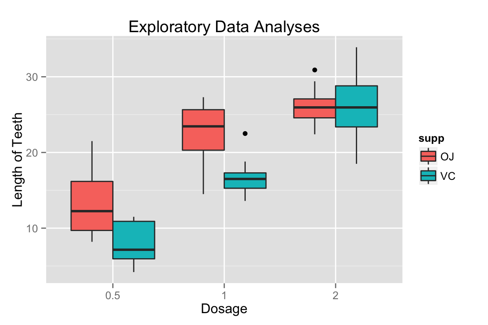

##Overview

Now in the second portion of the class, we're going to analyze the ToothGrowth data in the R datasets package. 

1. Load the ToothGrowth data and perform some basic exploratory data analyses 

2. Provide a basic summary of the data.

3. Use confidence intervals and/or hypothesis tests to compare tooth growth by supp and dose. (Only use the techniques from class, even if there's other approaches worth considering)

4. State your conclusions and the assumptions needed for your conclusions. 

##Load and explore data
```{r}
library(ggplot2)
library(knitr)
data(ToothGrowth)
str(ToothGrowth)

ggplot(ToothGrowth, aes(x = factor(dose), y = len, fill = supp)) +
        geom_boxplot() +
        labs(x = "Dosage", y = "Length of Teeth", title = "Exploratory Data Analyses")
```
 

##Basic summary
```{r}
Tooth2 = ToothGrowth
Tooth2$dose = as.factor(Tooth2$dose)
summary(Tooth2)
table(Tooth2$supp, Tooth2$dose)
```

##Compare tooth growth by supp and dose
```{r}
T_a = ToothGrowth
d_2 = subset(T_a, dose == 2)
d_1 = subset(T_a, dose == 1)
d_.5 = subset(T_a, dose == .5)
#t-test
tsupp <- t.test(len~I(relevel(supp, 2)), paired = FALSE, var.equal = FALSE, data = T_a)
t.5 <- t.test(len~I(relevel(supp, 2)), paired = FALSE, var.equal = FALSE, data = d_.5)
t1 <- t.test(len~I(relevel(supp, 2)), paired = FALSE, var.equal = FALSE, data = d_1)
t2 <- t.test(len~I(relevel(supp, 2)), paired = FALSE, var.equal = FALSE, data = d_2)
#collect result
result <- data.frame("p-value"=c(tsupp$p.value,t.5$p.value,t1$p.value,t2$p.value), 
     "CI_Lower"=c(tsupp$conf[1],t.5$conf[1],t1$conf[1],t2$conf[1]),
     "CI_Upper"=c(tsupp$conf[2],t.5$conf[2],t1$conf[2],t2$conf[2]),
     "Mean_VC" =c(tsupp$estimate[1],t.5$estimate[1],t1$estimate[1],t2$estimate[1]),
     "Mean_OJ" =c(tsupp$estimate[2],t.5$estimate[2],t1$estimate[2],t2$estimate[2]),
     row.names=c("OJ vs VC: ", "dose == 0.5", "dose == 1.0 ","dose == 2.0 "))
kable(result)
```

##Conclusion and assumptions
####Assumption:
The sample components are iid(independent and identically distributed).

####Conclition:
Generally, we can't reject H0 that OJ have sam effect as VC, because p-value > 5%.
When dose == 0.5 or 1.0, p-value is smaller than 1%, the confidence interval is smaller than zero, OJ has a greater effect on Tooth Growth than VC. When dose == 2.0, p-value is so large, we can't reject H0 that OJ and VC has a same effect on Tooth Growth.
